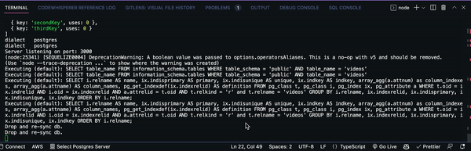
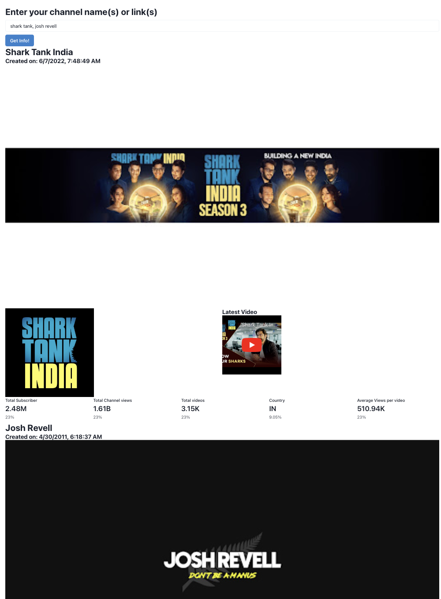
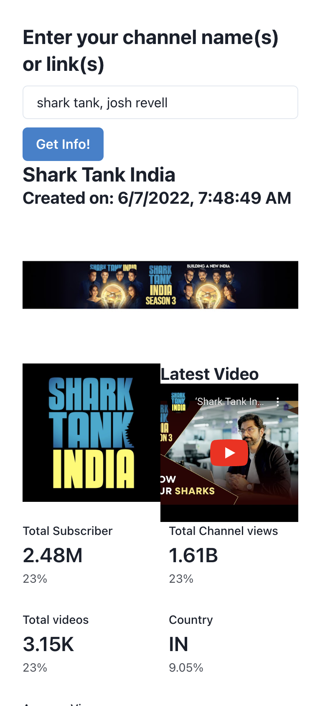
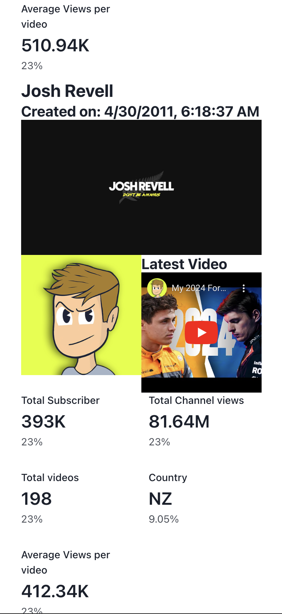

# BYOB-Assignment

Hi recruiters 🙋🏻‍♂️, this is my submission for the assignment-task for the ```Launch Internship Cohort``` for which the link can be found: [Notion - Launch Internship Assignment | BYOB](https://creatoreconomyventures.notion.site/Launch-Internship-Cohort-16890cc32dd840e9a17f272f74eefb8b?p=60a74ab6069f4d51840200051518f68b&pm=c)

## Important Links:
- The Backend(main code) repo can be found at: [Backend repo](https://github.com/jugaldb/byob-task)
- The frontend repo can be found at: [Frontend Repo](https://github.com/jugaldb/byob-frontend)
- The link to the frontend deployment is: [Frontend Deployment](https://byob-task.jugaldb.com)
- The link to the Backend deployment is: [Backend Deployment](https://byob-task-api.jugaldb.com)
- The postman collection can be found at: [Postman Docs](https://documenter.getpostman.com/view/10968840/2sA2rDy1iB)

## Features Implemented

✅ -  Server will fetch the channel via either name or the link of the channel!

✅ - Server will entertain multiple channels in the same request for batch processing using wait groups in Golang

✅ -  The link to the Postman docs: [Postman docs](https://documenter.getpostman.com/view/10968840/2sA2rDy1iB)

✅ - Dockerize the project. - ```Dockerfile``` and ```docker-compose.yml```

✅ - It is scalable and optimised.


✅ - Support for supplying multiple API keys so that if quota is exhausted on one, it automatically uses the next available key.
- Proof of concept

  


✅ - Make a dashboard to view the youtube aggregated data being fetched

- It is not the best UI I have designed but given the time constraint and the complexity, this is what I could achieve
  
  
  


- The deployed website can be found on: [Link](https://byob-task.jugaldb.com)

- The link to the frontend repo is: [Frotend repo](https://github.com/jugaldb/byob-frontend)


## Tech stack used:


## Tools used


## 1. Why Golang? 🤯

>- Well, Golang is the language I feel quite comfortable and proficient with it.
>- I have worked extensively with Python and NodeJs in production projects scaling to millions of users, but I feel Go is much better suited when it comes to performance and extracting it.
>- Error handling is also much more robust in Golang as compared to other languages.
>- Go has almost all the libraries out of the box and you hardly need to install anything from outside.


## 2. Why is my repo structure weird 🤦🏻‍♂️??
>- Independent of Frameworks. The architecture does not depend on the existence of some library of feature laden software. This allows you to use such frameworks as tools, rather than having to cram your system into their limited constraints.
>- Testable. The business rules can be tested without the UI, Database, Web Server, or any other external element.
>- Independent of UI. The UI can change easily, without changing the rest of the system. A Web UI could be replaced with a console UI, for example, without changing the business rules.
>- Independent of Database. You can swap out Oracle or SQL Server, for Mongo, BigTable, CouchDB, or something else. Your business rules are not bound to the database.
>- Independent of any external agency. In fact your business rules simply don’t know anything at all about the outside world.
 Obviously I am open to comments on these about how can it be better.

## Installation

1. Clone the repo ```git clone https://github.com/jugaldb/byob-task.git``` (assumes you have git installed).


Usage of [Clean Architecture](http://blog.cleancoder.com/uncle-bob/2012/08/13/the-clean-architecture.html)


## Running the project
- There are multiple ways to run the Project, once you are done with the prerequisites and the basic installation you can use either:

### 1. Using Docker and docker compose.
- Paste the following in your terminal <br>
  <code>cd (project directory)</code><br>
  ```docker build -t <image name> .```<br>

- Add in the necessary env variables from ```example.env``` file and change the name to ```.env```
- Run ```docker run --env-file ./.env``` to start the server.


### 2. Using go

1. Run using ```just run``` (assumes you have just installed)


### Alternatively you can directly
- Use: [Frontend](https://byob-task.jugaldb.com/) to check out the deployment
- Use: [Backend Link](https://byob-task-api.jugaldb.com/) with [Postman Docs](https://documenter.getpostman.com/view/10968840/2sA2rDy1iB) to check the backend.

## Acknowledgments 
